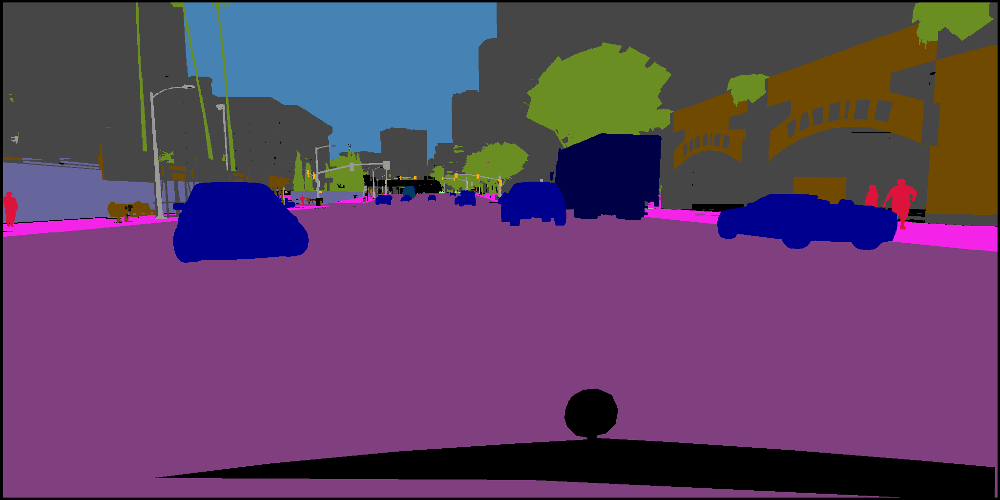
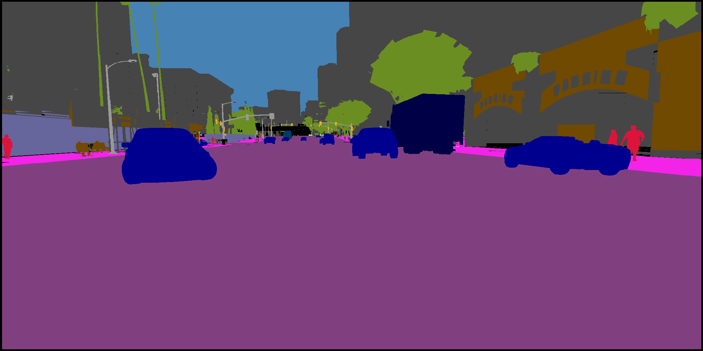
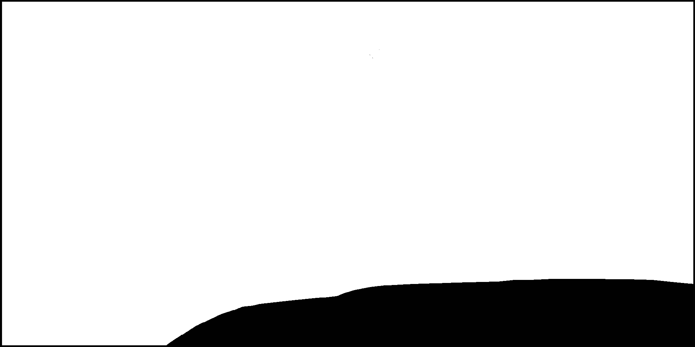

## Deep Learning & GTA V

The goal of the project is to see if synthetic images can be used to train neural networks for object detection with the aim of reducing the cumbersome task of labelling.

This project is divided into two parts :
- Part 1 : Generation of the synthetic dataset
- Part 2 : Training of object detection models with the synthetic dataset and other experiments

## Part 1 : Generation of the synthetic dataset

The focus of this part is to synthesize high resolution photorealistic images from the [GTA V video game](https://www.rockstargames.com/V/restricted-content/agegate/form?redirect=https%3A%2F%2Fwww.rockstargames.com%2FV%2F&options=&locale=en_us) with Deep Learning.

Part 1 is divided into studies that show the different steps that lead us to our results.  

---

#### Study1: study some articles that deal with photorealistic image synthesis and understand the format of the images that are given as input to the pix2pixHD algorithm
##### Articles

We studied the following articles:
- [pix2pix](https://arxiv.org/pdf/1611.07004.pdf)
- [pix2pixHD](https://arxiv.org/pdf/1711.11585.pdf)
- [vid2vid](https://tcwang0509.github.io/vid2vid/paper_vid2vid.pdf)

With pix2pixHD, it is possible to generate high-resolution photorealistic images. It is an improvement of pix2pix. vid2vid makes it possible to generate 30 second long photorealistic videos, which in fact implies generating photorealitic images that are coherent in time. After studying the articles, we concluded that pix2pixHD was the most appropriate algorithm to use since we wanted to generate images with a good visual quality.

pix2pixHD was developped and trained by NVIDIA on the [Cityscapes dataset](https://www.cityscapes-dataset.com/). It consists of original images taken from the real world and the corresponding segmentations. All the categories taken into account for segmentation are avaiblable on [Cityscapes' github](https://github.com/mcordts/cityscapesScripts/blob/master/cityscapesscripts/helpers/labels.py). The pix2pixHD model was trained to take 2048x1024 images as input and outputs 2048x1024 images.

Here is a video that shows some results of photorealistic image synthetis obtained by NVIDIA:  
https://www.youtube.com/watch?v=3AIpPlzM_qs&feature=youtu.be

##### Input of pix2pixHD

pix2pixHD takes two images as input:
- Semantic Label Map (SLM): elements that belong to a same category (e.g. car) have the same pixel value (e.g. 26 with Cityscapes' encoding)
- Instance Map (IM): within a category, elements can be distinguished from one another. Example: if there are two cars in the image, the first car will have 26000 as pixel value and the second car will have 26001 as pixel value (see [pix2pixHD issue on Github](https://github.com/NVIDIA/pix2pixHD/issues/11))

According to the pix2pixHD article "[...] [W]hen instance boundary information is added, adjacent cars have sharper boundaries.", that is why, on top of having the SLM as input, the IM improves the visual quality of the generated images. In fact, during the project we found that SLMs **and** IMs were necessary in order to generate photorealistic images with acceptable visual quality.

In their article, the pix2pixHD researchers say that they give the following images as input to pix2pixHD.

|  |  |
|:--:|:--:| 
| Figure 1 - Semantic Labels | Figure 2 - Boundary Map |

After looking more closely at their Github repository, we realised that the real inputs to pix2pixHD are the following images:

|  | 
|:--:|:--:| 
| Figure 3 - Semantic Label Map | Figure 4 - Instance Map |

Figures 1 to 4 correspond to the same image:
- Figure 1 is a colored version of Figure 3.
- Figure 2 contains only the edges of the objects in Figure 4

In order to distinguish the different objects within a same category in Figure 4, one should use an image processing software such as [Krita](https://krita.org/en/) on *Linux* and observe the pixel values of the objects.

##### Using pix2pixHD in inference mode

We wanted to use segmented images from the GTA V video game to generate photorealistic images with pix2pixHD.

pix2pixHD was trained on Cityscapes (weights are available on the [pix2pixHD Github repository](https://github.com/NVIDIA/pix2pixHD#Testing)) so we can use the already trained network and predict on segmented images from GTA V since Cityscapes and GTA V both represent an environnement with vehicles and pedestrians.

We used data from [Playing for Data](https://download.visinf.tu-darmstadt.de/data/from_games/) which consists of SLMs generated from the GTA V video game through a semi-automatic process. Unfortunately, no IMs were available in this dataset. Thus, we generated 5 IM by hand with [Krita](https://krita.org/en/).

##### Some results with Playing for Data

|  |  |
|:--:|:--:| 
| Figure 5 - Original Image from GTA V | Figure 6 - SLM in Color |

|  |  |
|:--:|:--:| 
| Figure 7 - SLM | Figure 8 - IM |

|  |  |
|:--:|:--:| 
| Figure 9 - Image generated with both SLM & IM | Figure 10 - Image generated with only SLM |

The results are very poor but we found afterwards that there was a bias in the pix2pixHD training set (Cityscapes).

We adress this issue in Study2.

---

#### Study2: What acts as a bias in Cityscapes ?

We realised that all images in the [pix2pixHD test set](https://github.com/NVIDIA/pix2pixHD/tree/master/datasets/cityscapes) contain the following elements, that we call a mask in our project.

|  |  |
|:--:|:--:| 
| Figure 11 - SLM in pix2pixHD test set | Figure 12 - IM in pix2pixHD test set |

| Mask | SLM in Color (2048x1024) | Synthesized Image |
|:--:|:--:|:--:|  
|  |  |  |
|  |  |  |
|  |  |  |
|  |  |  |
|  |  |  |
|  |  |  |
|  |  |  |
|  |  |  |
|  |  |  |
|  | Figure 13 - Impact of the mask on the synthesized image | |

In Figure 13, masks were applied on the SLM and IM. Best visual results were obtained with the following mask:

| &nbsp;&nbsp;&nbsp;&nbsp;&nbsp;&nbsp;&nbsp;&nbsp;&nbsp;&nbsp;&nbsp;&nbsp;&nbsp;&nbsp;&nbsp;&nbsp;&nbsp;&nbsp;&nbsp;&nbsp;&nbsp;&nbsp;&nbsp;&nbsp;&nbsp;&nbsp;&nbsp;&nbsp;&nbsp;&nbsp;&nbsp;&nbsp;&nbsp; |  | &nbsp;&nbsp;&nbsp;&nbsp;&nbsp;&nbsp;&nbsp;&nbsp;&nbsp;&nbsp;&nbsp;&nbsp;&nbsp;&nbsp;&nbsp;&nbsp;&nbsp;&nbsp;&nbsp;&nbsp;&nbsp;&nbsp;&nbsp;&nbsp;&nbsp;&nbsp;&nbsp;&nbsp;&nbsp;&nbsp;&nbsp;&nbsp;&nbsp; |
|:--:|:--:|:--:|
| | Figure 14 - Best Mask | |

---

#### Study3: Generate other IMs with Krita and synthesize new results

| SLM Color (2048x1024) | Synthesized Image with Best Mask |
|:--:|:--:|
|  |  |
|  |  |
|  |  |
|  |  |
|  |  |
| | Figure 15 |

---

As the results in Figure 15 were good enough, we decided to find a dataset with SLMs and IMs from GTA V in order to generate 10000 photorealistic images with the already trained pix2pixHD model on Cityscapes with 2048x1024 images as input. Playing for Data does not have IMs and we could not generate 10000 IMs by hand with *Krita*.

---

#### Study4: Find a new dataset with SLMs & IMs

We found a relatively big dataset: [Playing for Benchmarks](https://playing-for-benchmarks.org/).
- Training set
    - 134097 SLMs
    - 134097 IMs

- Validation set
    - 49815 SLMs
    - 49815 IMs

Playing for Benchmarks' dataset is not compatible with Cityscapes. We had to convert pixel values from SLMs and IMs to make the dataset Cityscapes compatible. Categories in Playing for Benchmarks that are not present in Cityscapes were labeled as 'unlabeled' or added to a similar category (e.g. 'tree' (Playing for Benchmarks), 'vegetation' (Cityscapes)).

We used the training set and validation set from Playing for Benchmarks to create a unique set composed of 10000 Cityscapes compatible SLMs and 10000 corresponding IMs.

## Part 2  : Training of object detection models with the synthetic dataset and other experiments

Part 2 of this project was conducted by Benjamin Deguerre, PhD student at INSA Rouen.

His article, for which I am a co-author, will be published soon.

---

#### References

- [pix2pixHD](https://github.com/NVIDIA/pix2pixHD)  
@inproceedings{wang2018pix2pixHD,
  title={High-Resolution Image Synthesis and Semantic Manipulation with Conditional GANs},
  author={Ting-Chun Wang and Ming-Yu Liu and Jun-Yan Zhu and Andrew Tao and Jan Kautz and Bryan Catanzaro},  
  booktitle={Proceedings of the IEEE Conference on Computer Vision and Pattern Recognition},
  year={2018}
}

- [Playing for Data](https://download.visinf.tu-darmstadt.de/data/from_games/)  
@InProceedings{Richter_2016_ECCV,
author = {Stephan R. Richter and Vibhav Vineet and Stefan Roth and Vladlen Koltun},
title = {Playing for Data: {G}round Truth from Computer Games},
booktitle = {European Conference on Computer Vision (ECCV)},
year = {2016},
editor = {Bastian Leibe and Jiri Matas and Nicu Sebe and Max Welling},
series = {LNCS}, 
volume = {9906}, 
publisher = {Springer International Publishing},
pages = {102--118}
}

- [Playing for Benchmarks](https://playing-for-benchmarks.org/)  
@InProceedings{Richter_2017,
title = {Playing for Benchmarks},
author = {Stephan R. Richter and Zeeshan Hayder and Vladlen Koltun},
booktitle = {{IEEE} International Conference on Computer Vision, {ICCV} 2017, Venice, Italy, October 22-29, 2017},
pages = {2232--2241},
year = {2017},
url = {https://doi.org/10.1109/ICCV.2017.243},
doi = {10.1109/ICCV.2017.243},            
}

---

#### Solved Issues with pix2pixHD
##### RuntimeError: CUDA out of memory. Tried to allocate 247.50 MiB (GPU 0; 10.92 GiB total capacity; 10.00 GiB already allocated; 134.31 MiB free; 107.02 MiB cached)

- https://github.com/NVIDIA/pix2pixHD/issues/19
- https://github.com/NVIDIA/pix2pixHD/issues/44
<br />

- In pix2pixHD/models/pix2pixHD_model.py, replace:

```
if torch.__version__.startswith('0.4'):
    with torch.no_grad():
        fake_image = self.netG.forward(input_concat)
    else:
        fake_image = self.netG.forward(input_concat)
```

- with the following code (make sure to respect the indentation):

```
with torch.no_grad():
    fake_image = self.netG.forward(input_concat)
```

##### ~/Desktop/pix2pixHD/models/pix2pixHD_model.py:130: UserWarning: volatile was removed and now has no effect. Use 'with torch.no_grad():' instead.
- In pix2pixHD/models/pix2pixHD_model.py, remove:

```
input_label = Variable(input_label, volatile=infer)
```
